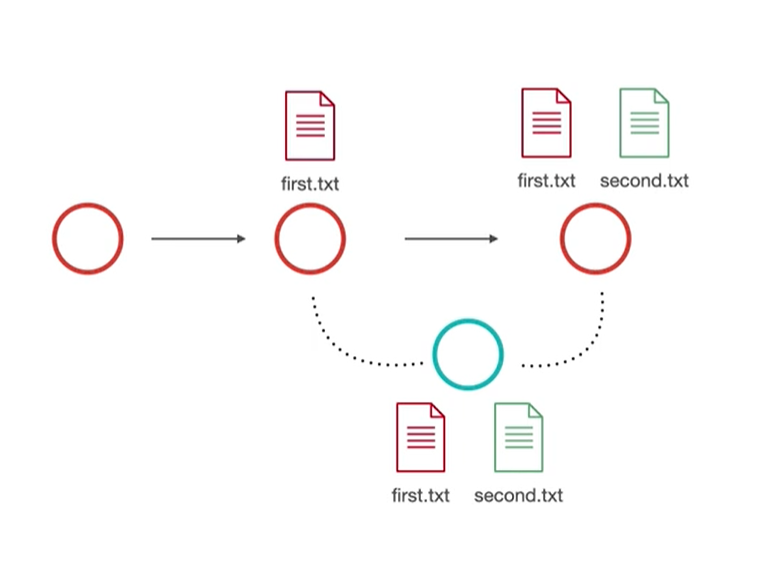
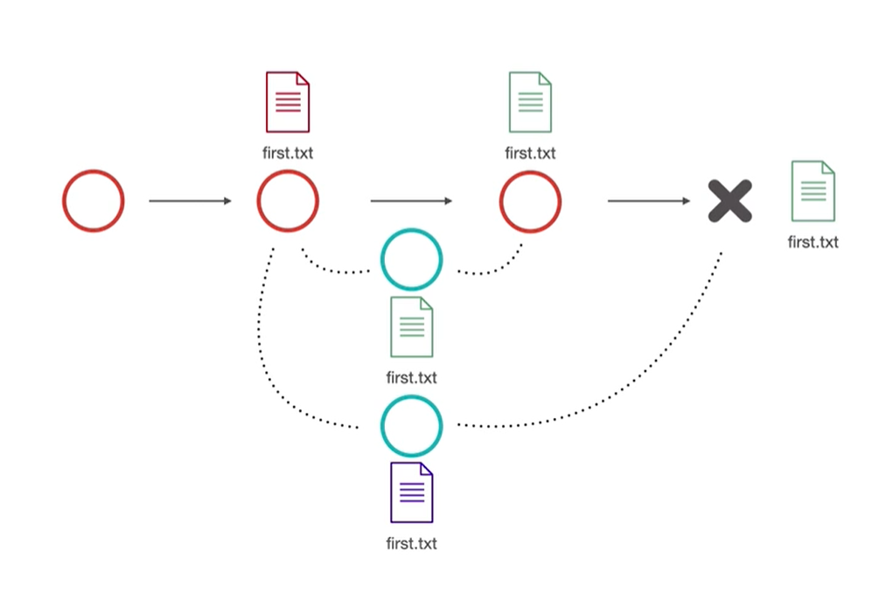

 

## **مفهوم الدمج | Merge**

---
### **ما هو الدمج؟**
بعد إحداث تغييرات على فرع من الفروع، قد يرغب المبرمج بحفظها على الفرع الرئيسي للمشروع. الدمج أو الـMerge يمكن المبرمج من توحيد المسارات المختلفة للمشروع وحفظها. 
هناك نوعين من الدمج، الأول يُدعى بالـFast-forward Merge والأخر بالـ True Merge.
>
1. **Fast-Forward Merge:** في هذا النوع يتم الدمج بشكل مباشر، فعلى سبيل المثال يتم إستخدام هذا النوع عند إضافة ملف جديد (second.txt) على المشروع لأن ذلك لا يولد أي تعارضات في النسخة المسبقة، فكل ما تم عمله هو إنشاء ملف جديد وليس التعديل على ملف سابق، كما هو موضح في الشكل أدناه. 

2. **True Merge:** قد يتسبب هذا النوع في تعارضات في نسخ المشروع ، ولذلك لا يتم الدمج مباشرةً، وعند حصول ذلك يطلب Git من المستخدم أن يختار من الإجراءات التالية، إما الإحتفاظ بأحدث نسخة أو النسخة المسبق وجودها في المسار الرئيسي أو كلتاهما. مثال على ذلك هو عند قيام مستخدمين بالتعديل على ملف واحد، فعند حصول ذلك يقوم المستخدم الأول بحفظ نسخته على المسار الرئيسي مما يسبب مشكلة في التزامن بين النسخ، فالمستخدم الثاني في هذه الحالة يمتلك نسخة قديمة من الملف الذي تم تغييره وذلك يمثل تعارض كما هو موضح في الشكل أدناه.

