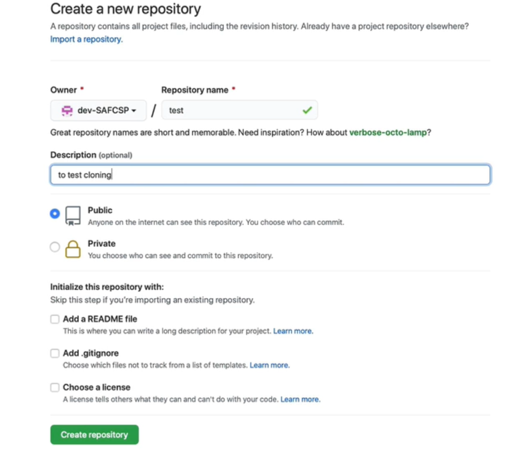

<div dir=rtl>

## **الأمر Git Clone**
---
لإنشاء Repository على GitHub، يتم تسجيل الدخول على GitHub وثم إختيار Create Repository. 
ستظهر عدة خيارات ومنها إختيار كون الـRepository خاصة أم عامة (تحديد من يستطيع الوصول إليها)  . وكذلك يمكن إنشاء ملف Read me أو ملف .Gitignore من الخيارات الموجودة بالأسفل.



لإستنساخ نسخة من الريبو الموجودة على GitHub محليًا يتم إستخدام أمر:

```
git clone repoistory link
``` 
قد يطلب Git إدخال أسم المستخدم والأيميل في حال لم يتم إدخالها مسبقًا.


</div>